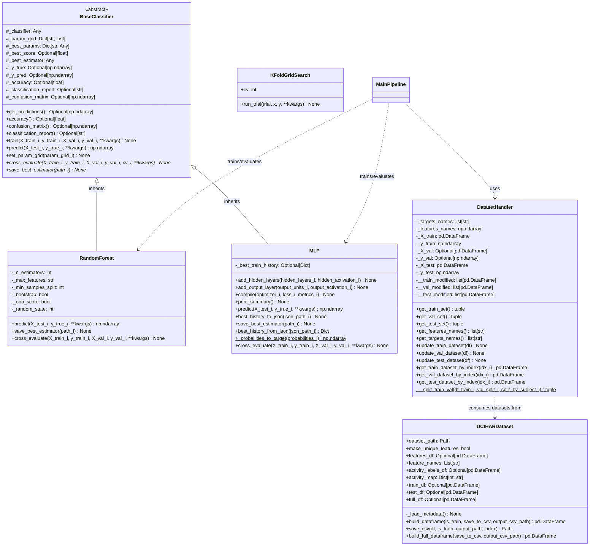

# ML Module – Acquired Competences Evaluation
## Human Activity Recognition using Machine Learning and Deep Learning Techniques

**Author:** Calogero Forte  
**Course:** Applied Machine Learning Post-graduate Course  
**Institution:** University of Palermo  
**Professors:** Liliana Lo Presti et al.  
**Date:** September 2026  

---

## Table of Contents
1. [Introduction](#1-introduction)
2. [Dataset Analysis and Data Preparation](#2-dataset-analysis-and-data-preparation)
   - [2.1 Statistics](#21-statistics)
   - [2.2 Dimensionality Reduction](#22-dimensionality-reduction)
     - [2.2.1 Correlation Analysis](#221-correlation-analysis)
     - [2.2.2 Principal Component Analysis (PCA)](#222-principal-component-analysis)
     - [2.2.3 Linear Discriminant Analysis (LDA)](#223-linear-discriminant-analysis)
3. [Machine Learning Models](#3-machine-learning-models)
   - [3.1 Random Forest on the Original Dataset](#31-random-forest-on-the-original-dataset)
   - [3.2 Random Forest on the LDA-Transformed Dataset](#32-random-forest-on-the-lda-transformed-dataset)
4. [Deep Learning Models](#4-deep-learning-models)
   - [4.1 MLP on the Original Dataset](#41-mlp-on-the-original-dataset)
   - [4.2 MLP on the LDA-Transformed Dataset](#42-mlp-on-the-lda-transformed-dataset)
5. [Model Comparisons and Conclusions](#5-model-comparisons-and-conclusions)
6. [AI Statement](#6-ai-statement)
7. [References](#7-references)
8. [Software Architecture and Class Diagram](#8-software-architecture-and-class-diagram)
9. [Codebase API Documentation (Docstrings)](#9-codebase-api-documentation-docstrings)

---

# 1. Introduction

The dataset considered for this activity is a smartphone-based **Human Activity Recognition (HAR)** dataset [1], created in the context of the work [2]. Data were acquired from 30 volunteers while performing six different physical activities:

- **WALKING** (`0`)
- **WALKING_UPSTAIRS** (`1`)
- **WALKING_DOWNSTAIRS** (`2`)
- **SITTING** (`3`)
- **STANDING** (`4`)
- **LAYING** (`5`)

The acquisition system recorded six inertial signals: three components of linear acceleration (expressed in $g$) and three components of angular velocity (expressed in $\text{rad/s}$).

The signals were sampled at a frequency of:
$$f_s = 50\text{ Hz}$$

The continuous measurements were divided into fixed time windows of 2.56 seconds. At the acquisition frequency, each window therefore contains $2.56 \times 50 = 128$ samples per sensor axis. A 50% overlap was used between consecutive windows.

A preprocessing stage was also applied to the acceleration measurements. The gravity component was filtered using a Butterworth filter with a cutoff frequency of $f_c = 0.3\text{ Hz}$.

After signal preprocessing, features were extracted from the sensor measurements. The resulting feature vector contains **561 numerical features** for each observation, describing the signal in both time and frequency domains.

Each observation is associated with an activity label (0–5) and a subject identifier.

The complete original dataset contains **10,299 samples**. An initial division into training and test data was already provided at subject level. However, in order to obtain a separate validation set while preserving subject independence, the original training data were subsequently divided into training and validation subsets according to subjects.

The final dataset used in the experiments consisted of:
- **5,551 training samples**
- **1,801 validation samples**
- **2,974 test samples**

The most important methodological characteristic of the partitioning strategy is that the training and validation split was performed **by subject rather than by individual observations**. Consequently, observations from a given subject are assigned exclusively to either the training or validation subset. This approach has been chosen to avoid potential sources of **data leakage**.

The final test dataset was maintained independently and was not used for hyperparameter optimization or model selection.

The objective of this work is to train a classical **Machine Learning (ML)** algorithm and a **Deep Learning (DL)** one, to predict the activity performed by a person by classifying these features into the six classes described.

First of all, each model has been evaluated on the dataset "as-it-is" to have a ground-truth of what was likely performed by the authors of the dataset [1] and, after that:
1. A statistical analysis has been performed on the dataset.
2. Various dimensionality reduction techniques have been tried.
3. The hyperparameters of each model have been chosen by Grid Search.
4. Final classification scores have been evaluated.

---

# 2. Dataset Analysis and Data Preparation

The data preparation stage consisted of statistical analysis, correlation analysis, dimensionality reduction, and data visualization.

Since the original dataset contains 561 features, several experiments were conducted to determine whether redundant or low-variance features could be removed without negatively affecting classification performances, aiming instead to enhance them.

## 2.1 Statistics

An initial statistical analysis was performed to characterise the numerical features. They were scaled to belong to the interval:
$$[-1, 1]$$

The observed mean values ranged between:
$$-0.9841 \le \mu \le 0.8304$$

while the variances ranged between:
$$0.0017 \le \sigma \le 0.5651$$

Low variability can motivate the use of variance-based feature selection.

A further analysis considered the distributions of six mean-based sensor features: the three mean axial acceleration components and the three mean axial angular velocity components:
- `tBodyAcc-mean-X`, `tBodyAcc-mean-Y`, `tBodyAcc-mean-Z`
- `tBodyGyro-mean-X`, `tBodyGyro-mean-Y`, `tBodyGyro-mean-Z`

Histograms of these variables showed approximately Gaussian-shaped distributions in agreement with the Central Limit theorem.

For what concerns the class distribution across the splits, they are almost balanced even if there are more examples for `STANDING` and `LAYING` than the various walking activities. The most difficult classes to separate were `STANDING` and `SITTING`, and as seen in Table 2.1, this was not due to unbalanced examples.

#### Table 2.1: Distribution of activity classes across the training, validation, and test sets.
| Activity | Train | Validation | Test | Total |
| :--- | :---: | :---: | :---: | :---: |
| **WALKING** | 888 | 338 | 496 | 1722 |
| **WALKING UPSTAIRS** | 797 | 276 | 471 | 1544 |
| **WALKING DOWNSTAIRS** | 744 | 242 | 420 | 1406 |
| **SITTING** | 993 | 293 | 491 | 1777 |
| **STANDING** | 1053 | 321 | 532 | 1906 |
| **LAYING** | 1076 | 331 | 537 | 1944 |
| **Total** | **5551** | **1801** | **2947** | **10299** |

---

## 2.2 Dimensionality Reduction

The original feature space consisted of 561 dimensions. These were mainly statistical measurements of the pre-processed inertial signals (mean, variance, energy, entropy, correlation, etc.).

Thus, even if there was no redundant information, there was room to reduce the dimensionality by removing low-variance and correlated features. Moreover, such a high-dimensional dataset was difficult to inspect for natural clustering or separation degree. Several dimensionality reduction strategies were investigated:

### 2.2.1 Correlation Analysis
A correlation analysis was first performed to identify redundant features. The correlation matrix of the original 561 features contains:
$$\frac{561(561 - 1)}{2} = 157,080 \text{ unique feature pairs in its upper triangular portion}$$

The analysis identified a large number of strongly correlated feature pairs. After retaining only one feature from groups of highly correlated variables ($r \ge 0.8$), the feature space was reduced from 561 to 174 dimensions:
$$561 \to 174$$

### 2.2.2 Principal Component Analysis (PCA)
In a second step, Principal Component Analysis (PCA) was applied to the correlation-reduced dataset.

After projecting the dataset in the PCA space with a variance threshold of:
$$\sigma_{th} = 0.9$$
a 64 principal components space was obtained.

The first principal component accounted for approximately:
$$\lambda_1 = 0.1840 \propto \sigma_1$$
of the total variance, while the eigenvalue associated with the 21st component was approximately:
$$\lambda_{21} = 0.0097 \propto \sigma_{21}$$

Based on the eigenvalue distribution, the first 20 components were selected for subsequent experiments:
$$561 \to 174 \to 20$$

However, PCA is an unsupervised transformation. Target classes are not considered during principal directions identification. Therefore, directions explaining large variance do not necessarily maximize separation between activity classes. When projected in 2D and 3D with t-Distributed Stochastic Neighbor Embedding (t-SNE), the classes remained highly overlapped. For this reason, the pipeline:
$$\text{Correlation} \to \text{PCA}$$
was discarded since there was no clear advantage.

### 2.2.3 Linear Discriminant Analysis (LDA)
Linear Discriminant Analysis (LDA) was investigated as a supervised alternative to PCA. Unlike PCA, LDA explicitly uses target labels when constructing the transformed representation to maximize between-class separation while minimizing within-class variability.

For a classification problem involving $C$ classes, LDA produces at most $C - 1$ discriminant components:
$$C - 1 = 6 - 1 = 5 \text{ components}$$

In this experiment, LDA was computed, and then the transformed features were standardized:
$$\hat{X} = \frac{X - M}{\Sigma}$$

t-SNE 2D and 3D visualizations in the LDA-transformed space showed clear class separation. Therefore, the data processing pipeline chosen was:
$$\text{LDA} \to \text{Standardization}$$

---

# 3. Machine Learning Models

To evaluate the performance of a conventional machine learning approach on the HAR problem, a **Random Forest** classifier was considered (since Support Vector Machines had already been explored in [2]). Random Forest is an ensemble learning method based on aggregating multiple decision trees.

Two input representations were evaluated:
1. The **original dataset** (all 561 features).
2. The **LDA-reduced representation** ($C - 1 = 5$ dimensions).

For both representations, a grid-search procedure was employed to identify optimal hyperparameters based on validation set performance.

---

## 3.1 Random Forest on the Original Dataset

The Random Forest classifier operated directly on all 561 input features without dimensionality reduction.

#### Table 3.1: Hyperparameters selected for the Random Forest trained on the original dataset
| Hyperparameter | Selected Value |
| :--- | :--- |
| **Number of estimators** | `100` |
| **Maximum depth** | `None` |
| **Minimum samples for split** | `5` |
| **Minimum samples per leaf** | `2` |
| **Maximum features** | `log2` |
| **Bootstrap** | `False` |

- **Training Accuracy:** `1.0000`
- **Validation Accuracy:** `0.9434`

A 100% accuracy on the training set suggested some degree of overfitting.

#### Table 3.2: Classification report of Random Forest trained on original dataset (Validation Set)
| Activity | Precision | Recall | F1-Score | Support |
| :--- | :---: | :---: | :---: | :---: |
| **WALKING** | 0.95 | 1.00 | 0.98 | 338 |
| **WALKING UPSTAIRS** | 0.82 | 1.00 | 0.90 | 276 |
| **WALKING DOWNSTAIRS** | 1.00 | 0.69 | 0.82 | 242 |
| **SITTING** | 0.94 | 0.98 | 0.96 | 293 |
| **STANDING** | 0.99 | 0.94 | 0.96 | 321 |
| **LAYING** | 1.00 | 0.99 | 1.00 | 331 |
| **Accuracy** | — | — | **0.94** | **1801** |
| **Macro avg** | 0.95 | 0.93 | 0.93 | 1801 |
| **Weighted avg** | 0.95 | 0.94 | 0.94 | 1801 |

---

## 3.2 Random Forest on the LDA-Transformed Dataset

A second Random Forest model was trained on the 5-dimensional LDA representation.

#### Table 3.3: Hyperparameters selected for Random Forest trained on the LDA-transformed dataset
| Hyperparameter | Selected Value |
| :--- | :--- |
| **Number of estimators** | `400` |
| **Maximum depth** | `6` |
| **Minimum samples for split** | `5` |
| **Minimum samples per leaf** | `1` |
| **Maximum features** | `sqrt` |
| **Bootstrap** | `True` |

- **Training Accuracy:** `0.9883`
- **Validation Accuracy:** `0.9667`

The combination of the LDA representation and constrained tree depth led to significantly better generalization.

#### Table 3.4: Classification report of Random Forest trained on LDA-transformed dataset (Validation Set)
| Activity | Precision | Recall | F1-Score | Support |
| :--- | :---: | :---: | :---: | :---: |
| **WALKING** | 0.96 | 1.00 | 0.98 | 338 |
| **WALKING UPSTAIRS** | 0.92 | 0.97 | 0.95 | 276 |
| **WALKING DOWNSTAIRS** | 1.00 | 0.88 | 0.93 | 242 |
| **SITTING** | 0.94 | 0.99 | 0.96 | 293 |
| **STANDING** | 0.99 | 0.95 | 0.97 | 321 |
| **LAYING** | 1.00 | 0.99 | 1.00 | 331 |
| **Accuracy** | — | — | **0.97** | **1801** |
| **Macro avg** | 0.97 | 0.96 | 0.96 | 1801 |
| **Weighted avg** | 0.97 | 0.97 | 0.97 | 1801 |

---

# 4. Deep Learning Models

To investigate deep learning models for the HAR task, a **Multi-Layer Perceptron (MLP)** was considered. MLPs were trained using the **Adam** optimizer and **sparse categorical cross-entropy** loss function. The output layer contained $C = 6$ neurons with **Softmax** activation, while **ReLU** was used in all hidden layers.

---

## 4.1 MLP on the Original Dataset

The MLP received all 561 input features directly.

#### Table 4.1: Hyperparameters selected for the MLP trained on the original dataset
| Hyperparameter | Selected Value |
| :--- | :--- |
| **Number of hidden layers** | `2` |
| **Units per hidden layer** | `7` |
| **Batch size** | `16` |
| **Epochs** | `15` |
| **Learning rate** | `0.01` |
| **Regularizer** | `None` |

- **Training Accuracy:** `0.9822` | **Validation Accuracy:** `0.9706`
- **Training Loss:** `0.0484` | **Validation Loss:** `0.1194`

Validation loss curves displayed non-monotonic spikes, indicative of non-robust training and mild overfitting.

#### Table 4.2: Classification report of MLP trained on the original dataset (Validation Set)
| Activity | Precision | Recall | F1-Score | Support |
| :--- | :---: | :---: | :---: | :---: |
| **WALKING** | 0.99 | 1.00 | 1.00 | 338 |
| **WALKING UPSTAIRS** | 0.95 | 0.96 | 0.95 | 276 |
| **WALKING DOWNSTAIRS** | 0.98 | 0.94 | 0.96 | 242 |
| **SITTING** | 0.96 | 0.94 | 0.95 | 293 |
| **STANDING** | 0.93 | 0.98 | 0.96 | 321 |
| **LAYING** | 1.00 | 0.99 | 0.99 | 331 |
| **Accuracy** | — | — | **0.97** | **1801** |
| **Macro avg** | 0.97 | 0.97 | 0.97 | 1801 |
| **Weighted avg** | 0.97 | 0.97 | 0.97 | 1801 |

---

## 4.2 MLP on the LDA-Transformed Dataset

The MLP was trained on the 5-dimensional standardized LDA feature space.

#### Table 4.3: Hyperparameters selected for the MLP trained on the LDA-transformed dataset
| Hyperparameter | Selected Value |
| :--- | :--- |
| **Number of hidden layers** | `2` |
| **Units per hidden layer** | `8` |
| **Batch size** | `64` |
| **Epochs** | `15` |
| **Learning rate** | `0.01` |
| **Regularizer** | `L1(0.01)` |

- **Training Accuracy:** `0.9849` | **Validation Accuracy:** `0.9833`
- **Training Loss:** `0.1640` | **Validation Loss:** `0.1852`

The training and validation accuracy curves converged monotonically with a gap of only $0.0015$, indicating high generalization capacity and stability.

#### Table 4.4: Classification report of MLP trained on LDA-transformed dataset (Validation Set)
| Activity | Precision | Recall | F1-Score | Support |
| :--- | :---: | :---: | :---: | :---: |
| **WALKING** | 1.00 | 1.00 | 1.00 | 338 |
| **WALKING UPSTAIRS** | 0.97 | 0.99 | 0.98 | 276 |
| **WALKING DOWNSTAIRS** | 1.00 | 0.97 | 0.98 | 242 |
| **SITTING** | 0.96 | 0.97 | 0.97 | 293 |
| **STANDING** | 0.97 | 0.97 | 0.97 | 321 |
| **LAYING** | 1.00 | 1.00 | 1.00 | 331 |
| **Accuracy** | — | — | **0.98** | **1801** |
| **Macro avg** | 0.98 | 0.98 | 0.98 | 1801 |
| **Weighted avg** | 0.98 | 0.98 | 0.98 | 1801 |

---

# 5. Model Comparisons and Conclusions

The experiments compared four classification pipelines combining two learning algorithms (Random Forest and MLP) across two feature spaces (original 561-dimensional vs. 5-dimensional LDA representation).

#### Table 5.1: Comparison of the classification performance of the four evaluated models (Validation Set)
| Model | Accuracy | Macro Precision | Macro Recall | Macro F1 | Weighted F1 |
| :--- | :---: | :---: | :---: | :---: | :---: |
| **RF – Original** | 0.94 | 0.95 | 0.93 | 0.93 | 0.94 |
| **RF – LDA** | 0.97 | 0.97 | 0.96 | 0.96 | 0.97 |
| **MLP – Original** | 0.97 | 0.97 | 0.97 | 0.97 | 0.97 |
| **MLP – LDA** | **0.98** | **0.98** | **0.98** | **0.98** | **0.98** |

### Selected Final Pipeline
Based on the experimental results, the selected best pipeline is:
$$\mathbf{\text{LDA}} \longrightarrow \mathbf{\text{Standardization}} \longrightarrow \mathbf{\text{MLP}}$$

### Final Evaluation on Test Set
The independently held-out test set (2,947 samples from unseen subjects) was evaluated using the optimal pipeline.

#### Table 5.2: Classification report of the selected MLP model with LDA on the final test set
| Activity | Precision | Recall | F1-Score | Support |
| :--- | :---: | :---: | :---: | :---: |
| **WALKING** | 0.96 | 0.99 | 0.97 | 496 |
| **WALKING UPSTAIRS** | 0.96 | 0.96 | 0.96 | 471 |
| **WALKING DOWNSTAIRS** | 1.00 | 0.97 | 0.98 | 420 |
| **SITTING** | 0.97 | 0.87 | 0.92 | 491 |
| **STANDING** | 0.89 | 0.98 | 0.93 | 532 |
| **LAYING** | 1.00 | 0.99 | 0.99 | 537 |
| **Accuracy** | — | — | **0.96** | **2947** |
| **Macro avg** | **0.96** | **0.96** | **0.96** | **2947** |
| **Weighted avg** | **0.96** | **0.96** | **0.96** | **2947** |

The results confirm that the selected model generalized remarkably well to unseen subjects, achieving an overall accuracy and weighted F1-score of **0.96**.

---

# 6. AI Statement

Generative Artificial Intelligence tools were used during the development of this project in a limited and supporting role.

In particular, Google Gemini was employed exclusively to assist with the mechanical and basic aspects of code implementation. The interaction with the AI tool was based on prompts that explicitly described how a specific operation or previously designed procedure should be implemented in code.

The conceptual design of the solution, including the choice of preprocessing procedures, dimensionality-reduction techniques, machine learning and deep learning models, experimental methodology, hyperparameter search strategy, and evaluation criteria, was determined by the author. Therefore, the AI tool was used primarily as a coding assistant to facilitate the translation of already defined procedures and algorithms into their corresponding software implementation.

No AI-generated output was considered a substitute for the author’s design decisions or understanding of the implemented methods. The resulting code, experimental procedures, and results were reviewed and evaluated by the author as part of the development process.

---

# 7. References

1. **D. Anguita, A. Ghio, L. Oneto, X. Parra, and J. L. Reyes-Ortiz**, *"A Public Domain Dataset for Human Activity Recognition Using Smartphones,"* 21st European Symposium on Artificial Neural Networks, Computational Intelligence and Machine Learning (ESANN), 2013.
2. **Davide Anguita, Alessandro Ghio, Luca Oneto, Francesc Parra, and Jorge L. Reyes-Ortiz**, *"Energy efficient smartphone-based activity recognition using fixed-point arithmetic,"* Journal of Universal Computer Science, vol. 19, no. 9, pp. 1295–1314, 2013.

---

# 8. Software Architecture and Class Diagram

The project is structured in a modular object-oriented architecture comprising data management, dimensionality reduction, statistical utilities, classifiers, evaluation metrics, and plotting utilities.



---

# 9. Codebase API Documentation (Docstrings)

Below is the complete API reference extracted directly from python docstrings across all modules.

```
Exam/
├── global_variables.py
├── main.py
├── dataset_preparation/
│   ├── uci_har_dataset.py
│   ├── dataset_handler.py
│   ├── statistics.py
│   └── dimensionality_reduction.py
├── classification/
│   ├── base_classifier.py
│   ├── random_forest.py
│   └── mlp.py
├── evaluation/
│   └── eval_utilities.py
└── utils/
    └── plot_utilities.py
```

---

### Module: `global_variables.py`
```python
"""
Module: 			global_variables.py
Project: 			ML_DL_Exam
Author: 			Calogero Forte
Revision: 		    1.12
Last modify date: 	09/11/2026
"""

SEED = 42
```

---

### Module: `dataset_preparation/uci_har_dataset.py`

#### Class: `UCIHARDataset`
```python
class UCIHARDataset:
    """
    Class to load, parse, internally represent, and export the UCI HAR 
    (Human Activity Recognition) Dataset.

    Parameters
    ----------
    dataset_path : str or Path, default="../../Dataset/UCI_HAR_Dataset"
        Path to the root directory containing the UCI HAR Dataset.
    make_unique_features : bool, default=True
        Whether to append unique numeric suffixes to duplicate feature names in features.txt 
        to ensure clean Pandas DataFrame column indexing.
    """
```

- **`_load_metadata(self) -> None`**
  ```python
  """
  Parses features.txt and activity_labels.txt and stores them in internal
  Pandas DataFrames and mappings.
  """
  ```

- **`build_dataframe(self, is_train: Union[bool, str] = True, save_to_csv: bool = False, output_csv_path: Optional[Union[str, Path]] = None) -> pd.DataFrame`**
  ```python
  """
  Builds a DataFrame for the Training set or Test set according to a flag.

  Parameters
  ----------
  is_train : bool or str, default=True
      Flag indicating split: True or 'train' for training data, False or 'test' for test data.
  save_to_csv : bool, default=False
      If True, automatically exports the generated DataFrame to a CSV file.
  output_csv_path : str or Path, optional
      File path for saving CSV. If None, defaults to '{split}_dataset.csv' in dataset_path.

  Returns
  -------
  pd.DataFrame
      The created Pandas DataFrame containing subject_id, 561 feature columns,
      target_name (second-to-last column), and target (last column).
  """
  ```

- **`save_csv(self, df: Optional[pd.DataFrame] = None, is_train: Optional[Union[bool, str]] = None, output_path: Optional[Union[str, Path]] = None, index: bool = False) -> Path`**
  ```python
  """
  Stores the dataset in a CSV file.

  Parameters
  ----------
  df : pd.DataFrame, optional
      The DataFrame to store. If None, uses train_df or test_df depending on is_train.
  is_train : bool or str, optional
      Flag to select split to build/save if df is not provided.
  output_path : str or Path, optional
      Destination CSV path. Defaults to dataset_path / 'uci_har_dataset.csv'.
  index : bool, default=False
      Whether to include row indices in the exported CSV.

  Returns
  -------
  Path
      Path of the saved CSV file.
  """
  ```

- **`build_full_dataframe(self, save_to_csv: bool = False, output_csv_path: Optional[Union[str, Path]] = None) -> pd.DataFrame`**
  ```python
  """
  Combines both training (7352 samples) and testing (2947 samples) sets
  into a single complete DataFrame of 10299 samples and 564 columns.

  Returns
  -------
  pd.DataFrame
      Combined DataFrame with all 10299 samples.
  """
  ```

---

### Module: `dataset_preparation/dataset_handler.py`

#### Class: `DatasetHandler`
```python
class DatasetHandler:
    """
    This class maintains the UCI HAR Dataset 
    in DataFrames for Train and Test and 
    provides method to get the data, to manage them and
    to save them again in CSV.
    """
```

- **`__init__(self, train_dataset_path_i: str, test_dataset_path_i: str, val_split_i: float = 0.0, split_by_subject_i: bool = True) -> None`**
- **`get_train_set(self) -> tuple[np.ndarray, np.ndarray]`**
- **`get_val_set(self) -> tuple[np.ndarray, np.ndarray]`**
- **`get_test_set(self) -> tuple[np.ndarray, np.ndarray]`**
- **`get_features_names(self) -> list[str]`**
- **`get_targets_names(self) -> list[str]`**
- **`update_train_dataset(self, df: pd.DataFrame) -> None`**
- **`update_val_dataset(self, df: pd.DataFrame) -> None`**
- **`update_test_dataset(self, df: pd.DataFrame) -> None`**
- **`get_train_dataset_by_index(self, idx_i: int) -> pd.DataFrame`**
- **`get_val_dataset_by_index(self, idx_i: int) -> pd.DataFrame`**
- **`get_test_dataset_by_index(self, idx_i: int) -> pd.DataFrame`**
- **`__split_train_val(df_train_i: pd.DataFrame, val_split_i: float = 0.2, split_by_subject_i: bool = True) -> tuple[pd.DataFrame, pd.DataFrame]`** *(Static)*
  ```python
  """
  Split the input training dataframe into a training set and a validation set.

  Parameters
  ----------
  df_train_i : pd.DataFrame
      The input training dataframe to split
  val_split_i : float, default=0.2
      The proportion of dataset to allocate to validation set
  split_by_subject_i : bool, default=True
      If True, split by subject_id so no subject_id in train remains in validation set.

  Returns
  -------
  tuple[pd.DataFrame, pd.DataFrame]
      A tuple (df_train, df_val)
  """
  ```

---

### Module: `dataset_preparation/statistics.py`

- **`compute_correlation(df: pd.DataFrame, abs_val: bool = True, tri_sup: bool = True) -> Tuple[np.ndarray, Optional[List[int]]]`**
  ```python
  """
  Computes the correlation matrix for a DataFrame with options for absolute values
  and upper triangular filtering. 

  Parameters
  ----------
  df : pd.DataFrame
      Input Pandas DataFrame containing numerical features.
  abs_val : bool, default=True
      If True, takes the absolute value of the correlation matrix.
  tri_sup : bool, default=True
      If True, retains only the upper triangular part of the matrix (where j > i),
      setting all other entries to zero.

  Returns
  -------
  Tuple[np.ndarray, Optional[dict]]: 
      - np.ndarray: Processed correlation matrix.
  """
  ```

- **`remove_correlated_features(X: Union[pd.DataFrame, np.ndarray], corr_matrix: np.ndarray, threshold: float = 0.8) -> Tuple[Union[pd.DataFrame, np.ndarray], np.ndarray]`**
  ```python
  """
  Removes correlated features from the feature matrix based on a correlation matrix (ndarray).

  A feature j is dropped only if it is correlated with a feature i that is 
  currently maintained in the dataset. If feature i was previously dropped, 
  feature j is not dropped due to feature i, ensuring features are not unnecessarily 
  removed if their correlated counterparts are no longer present.

  Parameters
  ----------
  X : pd.DataFrame or np.ndarray
      Matrix of features (samples x features).
  corr_matrix : np.ndarray
      Correlation matrix of shape (n_features, n_features).
  threshold : float, default=0.8
      Correlation threshold. Feature pairs with absolute correlation >= threshold
      are identified as correlated pairs.

  Returns
  -------
  Tuple[pd.DataFrame or np.ndarray, np.ndarray]
      - X_filtered : Matrix containing only the maintained features.
      - support : Boolean 1D NumPy array indicating which features were maintained (True) or dropped (False).
  """
  ```

---

### Module: `dataset_preparation/dimensionality_reduction.py`

- **`reduce_by_variance(df_i: pd.DataFrame, threshold_i: float = 0.1, X_test_i: Optional[pd.DataFrame] = None, X_val_i: Optional[pd.DataFrame] = None) -> Union[pd.DataFrame, Tuple[pd.DataFrame, ...]]`**
  ```python
  """
  Reduce the dataset dimensionality by removing features with low variance.

  Parameters
  ----------
  df_i : pd.DataFrame
      Input Pandas DataFrame containing numerical features for training.
  threshold_i : float, default=0.1
      Variance threshold cut-off i.e. the fraction of variance to remove.
  X_test_i : pd.DataFrame, optional
      Optional test dataset to transform.
  X_val_i : pd.DataFrame, optional
      Optional validation dataset to transform.

  Returns
  -------
  Union[pd.DataFrame, Tuple[pd.DataFrame, ...]]
      DataFrame containing only features above the variance threshold.
      If test/val sets are provided, returns tuple of transformed DataFrames.
  """
  ```

- **`reduce_by_pca(X_train_i: pd.DataFrame, X_test_i: pd.DataFrame, X_val_i: Optional[pd.DataFrame] = None, variance_i: float = 0.9) -> Union[Tuple[pd.DataFrame, pd.DataFrame], Tuple[pd.DataFrame, pd.DataFrame, pd.DataFrame]]`**
  ```python
  """
  Reduce the dataset dimensionality by applying PCA.

  Parameters
  ----------
  X_train_i : pd.DataFrame
      Input Pandas DataFrame containing train dataset.
  X_test_i : pd.DataFrame
      Input Pandas DataFrame containing test dataset.
  X_val_i : pd.DataFrame, optional
      Optional Pandas DataFrame containing validation dataset.
  variance_i : float, default=0.9
      Target variance ratio to preserve.

  Returns
  -------
  Union[Tuple[pd.DataFrame, pd.DataFrame], Tuple[pd.DataFrame, pd.DataFrame, pd.DataFrame]]
      Tuple containing the PCA-transformed features (X_train_pca, X_test_pca)
      or (X_train_pca, X_val_pca, X_test_pca) if X_val_i is provided.
  """
  ```

- **`reduce_by_lda(X_train_i: pd.DataFrame, y_train_i: np.ndarray, X_test_i: pd.DataFrame, X_val_i: Optional[pd.DataFrame] = None, n_components_i: Optional[int] = None) -> Union[Tuple[pd.DataFrame, pd.DataFrame], Tuple[pd.DataFrame, pd.DataFrame, pd.DataFrame]]`**
  ```python
  """
  Reduce the dataset dimensionality by applying Linear Discriminant Analysis.

  Parameters
  ----------
  X_train_i : pd.DataFrame
      Input Pandas DataFrame containing train dataset.
  y_train_i : np.ndarray
      Input target labels for train dataset.
  X_test_i : pd.DataFrame
      Input Pandas DataFrame containing test dataset.
  X_val_i : pd.DataFrame, optional
      Optional Pandas DataFrame containing validation dataset.
  n_components_i : int, default=None
      Number of components to reduce the dataset to.

  Returns
  -------
  Union[Tuple[pd.DataFrame, pd.DataFrame], Tuple[pd.DataFrame, pd.DataFrame, pd.DataFrame]]
      Tuple containing the LDA-transformed features (X_train_lda, X_test_lda)
      or (X_train_lda, X_val_lda, X_test_lda) if X_val_i is provided.
  """
  ```

- **`reduce_by_tsne(df_i: pd.DataFrame, n_components_i: int = 2, X_test_i: Optional[pd.DataFrame] = None, X_val_i: Optional[pd.DataFrame] = None) -> Union[pd.DataFrame, Tuple[pd.DataFrame, ...]]`**
  ```python
  """
  Reduce the dataset dimensionality by applying t-SNE.

  Parameters
  ----------
  df_i : pd.DataFrame
      Input Pandas DataFrame containing dataset to reduce.
  n_components_i : int, default=2
      Number of components to reduce the dataset to.
  X_test_i : pd.DataFrame, optional
      Optional test DataFrame.
  X_val_i : pd.DataFrame, optional
      Optional validation DataFrame.

  Returns
  -------
  Union[pd.DataFrame, Tuple[pd.DataFrame, ...]]
      t-SNE transformed DataFrame or tuple of transformed DataFrames.
  """
  ```

---

### Module: `classification/base_classifier.py`

#### Class: `BaseClassifier(ABC)`
```python
class BaseClassifier(ABC):
    """
    Base class for all classifiers.
    """
```

- **`__init__(self) -> None`**
  ```python
  """
  Initialize the Base Classifier

  Parameters
  ----------
  None

  Returns
  -------
  None
  """
  ```

- **`get_predictions(self) -> Optional[np.ndarray]`**
  ```python
  """
  Get the predictions

  Parameters
  ----------
  None

  Returns
  -------
  np.ndarray | None
      The predictions if the classifier has been ran, None otherwise
  """
  ```

- **`accuracy(self) -> Optional[float]`** *(Property)*
  ```python
  """
  Get the accuracy

  Parameters
  ----------
  None

  Returns
  -------
  float | None
      The accuracy if the classifier has been ran, None otherwise
  """
  ```

- **`confusion_matrix(self) -> Optional[np.ndarray]`** *(Property)*
  ```python
  """
  Get the confusion matrix

  Returns
  -------
  Optional[np.ndarray]
      The confusion matrix if the classifier has been ran, None otherwise
  """
  ```

- **`classification_report(self) -> Optional[str]`** *(Property)*
  ```python
  """
  Get the classification report

  Returns
  -------
  Optional[str]
      The classification report if the classifier has been ran, None otherwise
  """
  ```

- **`train(self, X_train_i: np.ndarray | pd.DataFrame, y_train_i: np.ndarray | pd.Series, X_val_i: Optional[np.ndarray | pd.DataFrame] = None, y_val_i: Optional[np.ndarray | pd.Series] = None, **kwargs: Any) -> None`**
  ```python
  """
  Train the base classifier. Works for both scikit-learn estimators and Keras models.

  Parameters
  ----------
  X_train_i : np.ndarray | pd.DataFrame
      The input features for training
  y_train_i : np.ndarray | pd.Series
      The target labels for training
  X_val_i : np.ndarray | pd.DataFrame, optional
      The input features for validation (used if model is a Keras model), default=None
  y_val_i : np.ndarray | pd.Series, optional
      The target labels for validation (used if model is a Keras model), default=None
  **kwargs :
      Additional arguments passed to fit (e.g. epochs, batch_size for Keras)
  """
  ```

- **`predict(self, X_test_i: np.ndarray, y_true_i: np.ndarray | pd.Series, **kwargs: Any) -> np.ndarray`**
  ```python
  """
  Predict and return target labels for input features.
  Uses the base classifier or the best estimator if cross-evaluation has been performed.
  Works for both scikit-learn estimators and Keras models.
  Stores predictions, classification report, accuracy, and confusion matrix internally.

  Parameters
  ----------
  X_test_i : np.ndarray | pd.DataFrame
      The input features for prediction
  y_true_i : np.ndarray | pd.Series
      The target labels for prediction
  **kwargs :
      Additional arguments passed to predict (e.g. batch_size for Keras)

  Returns
  -------
  np.ndarray
      The predicted target labels
  """
  ```

- **`set_param_grid(self, param_grid_i: Dict[str, List]) -> None`**
  ```python
  """
  Set the parameter grid
  """
  ```

- **`cross_evaluate(self, X_train_i: np.ndarray | pd.DataFrame, y_train_i: np.ndarray | pd.Series, X_val_i: Optional[np.ndarray | pd.DataFrame] = None, y_val_i: Optional[np.ndarray | pd.Series] = None, cv_i: int = 5, **kwargs) -> None`** *(Abstract)*
  ```python
  """
  Cross-evaluate the classifier using scikit-learn GridSearchCV or K-Fold for Keras models.

  Parameters
  ----------
  X_train_i : np.ndarray | pd.DataFrame
      The input features for cross-evaluation
  y_train_i : np.ndarray | pd.Series
      The target labels for cross-evaluation
  X_val_i : np.ndarray | pd.DataFrame, optional
      The input features for validation (if applicable), default=None
  y_val_i : np.ndarray | pd.Series, optional
      The target labels for validation (if applicable), default=None
  cv_i : int, default=5
      The number of folds for cross-evaluation

  Returns
  -------
  None
  """
  ```

- **`save_best_estimator(self, path_i: str) -> None`** *(Abstract)*
  ```python
  """
  Save the best estimator to a file

  Parameters
  ----------
  path_i : str
      The path to the file

  Return
  ------
  None
  """
  ```

---

### Module: `classification/random_forest.py`

#### Class: `RandomForest(BaseClassifier)`
```python
class RandomForest(BaseClassifier):
    """
    Random Forest Classifier implementing cross-evaluation grid-search and estimator persistence.
    """
```

- **`__init__(self, n_estimators_i: int = 400, max_features_i: str = 'sqrt', min_samples_split_i: int = 10, bootstrap_i: bool = True, oob_score_i: bool = True, random_state_i: int = global_variables.SEED)`**
  ```python
  """
  Constructor of the Random Forest class.
  
  Parameters
  ----------
  n_estimators_i : int, default=400
      The number of trees in the forest.
  max_features_i : str, default='sqrt'
      The number of features to consider when looking for the best split.
  min_samples_split_i : int, default=10
      The minimum number of samples required to split an internal node.
  bootstrap_i : bool, default=True
      Whether bootstrap samples are used when building trees.
  oob_score_i : bool, default=True
      Whether to use out-of-bag samples to estimate the generalization error.
  random_state_i : int, default=global_variables.SEED
      Controls the randomness of the bootstrapping and feature sampling.
  """
  ```

- **`predict(self, X_test_i: np.ndarray | pd.DataFrame, y_true_i: np.ndarray | pd.Series, **kwargs) -> np.ndarray`**
- **`save_best_estimator(self, path_i: str) -> None`**
- **`cross_evaluate(self, X_train_i: np.ndarray | pd.DataFrame, y_train_i: np.ndarray | pd.Series, X_val_i: np.ndarray | pd.DataFrame, y_val_i: np.ndarray | pd.Series, **kwargs) -> None`**
  ```python
  """
  Override of the base cross_evaluate method for RandomForest.

  Parameters
  ----------
  X_train_i : np.ndarray | pd.DataFrame
      The input features for training
  y_train_i : np.ndarray | pd.Series
      The target labels for training
  X_val_i : np.ndarray | pd.DataFrame
      The input features for validation
  y_val_i : np.ndarray | pd.Series
      The target labels for validation
  **kwargs :
      Additional keyword arguments
  """
  ```

---

### Module: `classification/mlp.py`

#### Class: `KFoldGridSearch(kt.GridSearch)`
```python
class KFoldGridSearch(kt.GridSearch):
    """
    Subclass of keras_tuner.GridSearch performing K-Fold cross-validation for each hyperparameter trial.
    """
```

#### Class: `MLP(BaseClassifier)`
```python
class MLP(BaseClassifier):
    """
    Multi-Layer Perceptron (MLP) Classifier implementing Keras Sequential neural network architectures,
    deterministic seed initialization, grid-search hyperparameter optimization, and JSON history exports.
    """
```

- **`add_hidden_layers(self, hidden_layers_i: List[int], hidden_activation_i: Optional[List[str]] = None) -> None`**
  ```python
  """
  Add one or multiple hidden layers with the specified number of units and activation function

  Parameters
  ----------
  hidden_layers_i : List[int]
      number of units for each hidden layer
  hidden_activation_i : List[str]
      activation function for each hidden layer.
      If None, ReLU is used for all hidden layers.

  Return
  ------
  None
  """
  ```

- **`add_output_layer(self, output_units_i: int, output_activation_i: Optional[str] = None) -> None`**
  ```python
  """
  Add the output layer with the specified number of units and activation function

  Parameters
  ----------
  output_units_i : int
      number of units for the output layer
  output_activation_i : str
      activation function for the output layer.
      If None, softmax is used for all output layers.

  Return
  ------
  None
  """
  ```

- **`compile(self, optimizer_i='adam', loss_i='sparse_categorical_crossentropy', metrics_i=['accuracy']) -> None`**
  ```python
  """
  Compile the model with the specified optimizer, loss function and metrics

  Parameters
  ----------
  optimizer_i : str
      The optimizer to use
  loss_i : str
      The loss function to use
  metrics_i : List[str]
      The metrics to use
  
  Return
  ------
  None
  """
  ```

- **`print_summary(self) -> None`**
  ```python
  """
  Print the summary of the model

  Parameters
  ----------
  None

  Return
  ------
  None
  """
  ```

- **`predict(self, X_test_i: np.ndarray | pd.DataFrame, y_true_i: np.ndarray | pd.Series, **kwargs) -> np.ndarray`**
- **`best_history_to_json(self, json_path_i: str) -> None`**
  ```python
  """
  Save the history of the best trial to a JSON file

  Parameters
  ----------
  json_path_i : str
      The path to the JSON file

  Return
  ------
  None
  """
  ```

- **`save_best_estimator(self, path_i: str) -> None`**
- **`best_history_from_json(json_path_i: str) -> Dict[str, List[float]]`** *(Static)*
  ```python
  """
  Load the history of the best trial from a JSON file

  Parameters
  ----------
  json_path_i : str
      The path to the JSON file

  Return
  ------
  Dict[str, List[float]]
      The history of the best trial
  """
  ```

- **`_probailities_to_target(probabilities_i: np.ndarray) -> np.ndarray`** *(Static)*
  ```python
  """
  Convert probabilities to target labels

  Parameters
  ----------
  probailities_i : np.ndarray
      The probabilities to convert

  Return
  ------
  np.ndarray
      The target labels
  """
  ```

- **`cross_evaluate(self, X_train_i: np.ndarray | pd.DataFrame, y_train_i: np.ndarray | pd.Series, X_val_i: np.ndarray | pd.DataFrame, y_val_i: np.ndarray | pd.Series, **kwargs) -> None`**
  ```python
  """
  Override of the base cross_evaluate method for MLP.

  Parameters
  ----------
  X_train_i : np.ndarray | pd.DataFrame
      The input features for training
  y_train_i : np.ndarray | pd.Series
      The target labels for training
  X_val_i : np.ndarray | pd.DataFrame
      The input features for validation
  y_val_i : np.ndarray | pd.Series
      The target labels for validation
  **kwargs :
      Additional keyword arguments
  """
  ```

---

### Module: `evaluation/eval_utilities.py`

- **`print_classification_report(classifier_i: BaseClassifier) -> None`**
  ```python
  """
  Print the classification report.
  
  Returns
  -------
  None
  """
  ```

- **`print_accuracy(classifier_i: BaseClassifier) -> None`**
  ```python
  """
  Print the accuracy.
  
  Returns
  -------
  None
  """
  ```

- **`plot_confution_matrix(classifier_i: BaseClassifier) -> None`**
  ```python
  """
  Plot the confusion matrix.
  
  Returns
  -------
  None
  """
  ```

---

### Module: `utils/plot_utilities.py`

- **`plot_xy_series(x_i: np.ndarray, y_i: np.ndarray, fs_i: float = 1.0, title_i: str = 'time_series', xlabel_i: str = 'x', ylabel_i: str = 'y') -> None`**
  ```python
  """
  Plot a X-Y graph. It can be used to plot a time series of 
  frequency f Hz, sampled at fs Hz

  Parameters
  ----------
  x_i : array_like
      x-axis values
  y_i : array_like
      y-axis values
  fs_i : float
      sampling frequency in Hz. Default is 1.0 Hz
  title_i : str
      title of the plot. Default is 'time_series'
  xlabel_i : str
      label of the x-axis. Default is 'x'
  ylabel_i : str
      label of the y-axis. Default is 'y'

  Return
  -------
  None
  """
  ```

- **`plot_heatmap(data_i: np.ndarray, title_i: str = 'Heatmap', xlabel_i: str = 'x_label', ylabel_i: str = 'y_label', color_i: str = 'coolwarm', format_i: str = '.2f') -> None`**
  ```python
  """
  Plot an Heat-map of the matrix given as data_i input.

  Parameters
  ----------
  data_i : array_like
      data matrix to plot
  title_i : str
      title of the plot. Default is 'Heatmap'
  xlabel_i: str
      label of the x-axis. Default is 'x_label'
  ylabel_i: str
      label of the y-axis. Default is 'y_label'
  color_i : str
      color map to use. Default is 'coolwarm'
  format_i : str
      format of the values to plot. Default is '.2f'

  Return
  -------
  None
  """
  ```

- **`plot_scatter(data_i: np.ndarray, classes_i: np.ndarray = None, labels_i: list[str] = None, marker_i: str = None, title_i: str = 'Scatter plot', xlabel_i: str = 'xlabel', ylabel_i: str = 'ylabel') -> None`**
  ```python
  """
  Plot the Scatter plot of the data_i.

  Parameters
  ----------
  data_i : array_like
      data matrix to plot. Data are arranged by rows,
      columns are the axis (x, y)
  classes_i: array_like, default=None
      list of classes to plot. Default is None.
      If classes is not None, labels shall be provided.
  labels_i : list[str]
      labels of the plot. Default is None.
      If Labels is not None, a mask is applied to the rows of
      the data_i and a scatter is plotted for each label (i.e. a class).
  marker_i : str
      marker to use. Default is None
  title_i : str
      title of the plot. Default is 'Scatter plot'
  xlabel_i : str
      label of the x-axis. Default is 'xlabel'
  ylabel_i : str
      label of the y-axis. Default is 'ylabel'

  Return
  ------
  None
  """
  ```

- **`plot_scatter_3d(data_i: np.ndarray, classes_i: np.ndarray = None, labels_i: list[str] = None, marker_i: str = None, title_i: str = '3D Scatter plot', xlabel_i: str = 'xlabel', ylabel_i: str = 'ylabel', zlabel_i: str = 'zlabel') -> None`**
  ```python
  """
  Plot the 3D Scatter plot of the data_i.

  Parameters
  ----------
  data_i : array_like
      data matrix to plot. Data are arranged by rows,
      columns are the axis (x, y, z)
  classes_i: array_like, default=None
      list of classes to plot. Default is None.
      If classes is not None, labels shall be provided.
  labels_i : list[str]
      labels of the plot. Default is None.
      If Labels is not None, a mask is applied to the rows of
      the data_i and a scatter is plotted for each label (i.e. a class).
  marker_i : str
      marker to use. Default is None
  title_i : str
      title of the plot. Default is '3D Scatter plot'
  xlabel_i : str
      label of the x-axis. Default is 'xlabel'
  ylabel_i : str
      label of the y-axis. Default is 'ylabel'
  zlabel_i : str
      label of the z-axis. Default is 'zlabel'

  Return
  ------
  None
  """
  ```

- **`plot_series(data_i: list[np.array], labels_i: Optional[list[str]] = None, title_i: str = 'Series plot', xlabel_i: str = 'x_label', ylabel_i: str = 'y_label') -> None`**
  ```python
  """
  Plot a list of numeric series.

  Parameters
  ----------
  data_i : list[np.array]
      list of series to plot
  labels_i : list[str]
      labels of the plot. It shall be of the same size of data_i.
      Default is None.
  title_i : str
      title of the plot. Default is 'Series plot'
  xlabel_i : str
      label of the x-axis. Default is 'xlabel'
  ylabel_i : str
      label of the y-axis. Default is 'ylabel'

  Return
  ------
  None
  """
  ```

- **`plot_histogram(data_i: Union[pd.Series, np.ndarray], bins_i: int = 20, title_i: str = 'Histogram', xlabel_i: str = 'bins', ylabel_i: str = 'counts') -> None`**
  ```python
  """
  Plot a histogram of the data_i.

  Parameters
  ----------
  data_i : Union[pd.Series, np.ndarray]
      data to plot
  bins_i : int
      number of bins to use. Default is 20
  title_i : str
      title of the plot. Default is 'Histogram'
  xlabel_i : str
      label of the x-axis. Default is 'xlabel'
  ylabel_i : str
      label of the y-axis. Default is 'ylabel'

  Return
  ------
  None
  """
  ```
